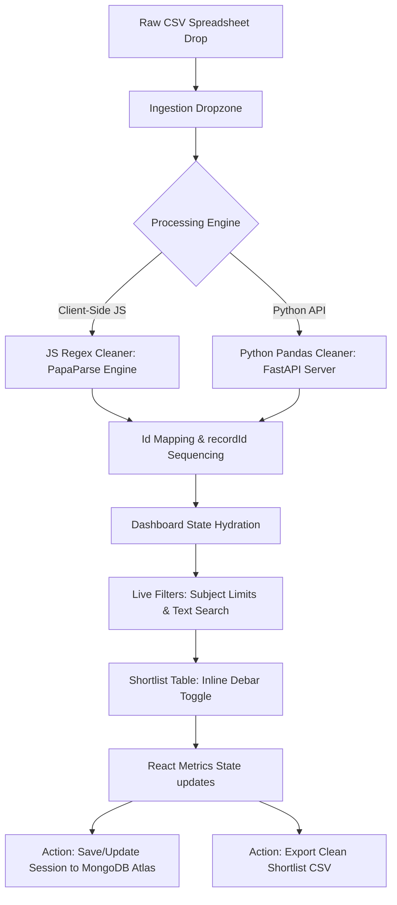
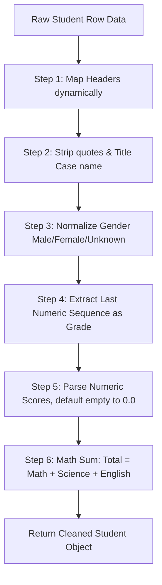

<div align="center">
  
  <h1>🎓 Student Data Pipeline & UI</h1>
  <p><strong>An enterprise-grade screening portal built to ingest, clean, and analyze student recruitment records.</strong></p>

  <p>
    <a href="https://nextjs.org/"></a>
    <a href="https://tailwindcss.com/"></a>
    <a href="https://www.python.org/"></a>
    <a href="https://fastapi.tiangolo.com/"></a>
    <a href="https://www.mongodb.com/"></a>
  </p>

  <h4>
    <a href="https://rm-selection-board.vercel.app/">🚀 Live Platform Deployment</a>
    <span> · </span>
    <a href="#-video-walkthrough">📹 Video Walkthrough</a>
  </h4>
</div>

> [!NOTE]
> **Zero Backend Setup Required**: By default, the application runs entirely on the self-contained **Client-Side JavaScript Engine**. You can clone, run `npm install && npm run dev`, and begin cleaning spreadsheets immediately. The Python FastAPI backend is **strictly optional** and serves solely as an alternative processing demonstration.

---

### 📹 Video Walkthrough

Click the thumbnail below to watch a 90-second video demonstrating the data ingestion, real-time filtering, session persistence, and export functions:

<div align="center">
  <a href="https://rm-selection-board.vercel.app/"></a>
</div>

---

## 🗺️ System Flow Architecture

The flowchart below maps out the candidate data path from ingestion inside the React dropzone up to persistence in MongoDB Atlas:



---

## ⚡ Core Features

*   **📥 Drag & Drop Ingestion**: Instantly drop raw, noisy CSV files into an active, dropzone container spanning the entire drop area.
*   **⚙️ Dual Cleaning Engines**:
    *   *JS Engine (Default)*: Fast client-side regex cleansing using PapaParse. Self-contained and works completely offline.
    *   *Python Engine (Alternative)*: Connects to a FastAPI microservice for vectorized dataframe cleanup using Pandas.
*   **🚫 Real-Time Debar Toggle**: Exclude or reinstate candidates via an inline switch with `0ms` database latency, instantly recalculating metrics.
*   **📊 Live metrics grid**: Floating dashboards displaying total loaded, active shortlist, debarred count, and calculated average scores.
*   **💾 Database Hydration**: Save, overwrite, or delete sessions locally and pull states back from your remote MongoDB Atlas history.
*   **📥 Custom CSV Exporter**: Download standard CSV files containing the current cleaned shortlisted candidate records.
*   **📄 Structured PDF Exporter**: Generate and download professional PDF reports of the active shortlist candidates, automatically formatted with DTU branding, current threshold requirements, and average scores using `jspdf`.
*   **⚠️ Data Quality Warnings & Review Filter**: Automatically identifies ambiguous or anomalous entries (e.g. unknown gender, unparseable grades, missing marks) with non-destructive soft warnings and a dedicated **Needs Review** filter tab.

### 📊 Engine Comparison

| Feature / Metric | Client-Side JS Engine (Default) | Python Pandas Engine (Alternative) |
| :--- | :--- | :--- |
| **Tech Stack** | PapaParse + JavaScript Regex | FastAPI + Pandas DataFrames |
| **Execution Location** | Directly in the client browser | Remote self-hosted Python microservice |
| **Network Request** | 0 (Self-contained, works offline) | 1 HTTP POST upload request |
| **Scalability** | Ideal for standard lists (up to 20k rows) | High-performance vectorized multi-GB tables |
| **Cleansing Method** | String iteration with regex matching | Vectorized Series manipulation in Pandas |
| **Dependencies** | Zero external API calls | Requires python environment & fastapi server |

---

## ⚙️ The Data-Cleaning Pipeline (Detailed Walkthrough)

Both cleaning engines run matching rules to normalize inconsistent raw rows.



### 🔍 Step 1: Dynamic Column Mapping
CSV headers are mapped to the schema by scanning for lowercase substrings:
* `name` matching columns (e.g. `Student Name`, `Candidate Name`) $\rightarrow$ mapped to `name`.
* `math`, `science`, and `english` columns $\rightarrow$ mapped to subject scores.

### 🔠 Step 2: Name Standardizer (Regex & Title Case)
Strips quotes, trims padding spaces, and converts names to Title Case:
* **Regex Rule**: `String(val).replace(/['"]/g, '').trim()`
* **Capitalizer Pattern**: First letter of each word is converted using `/\b\w/g`.
* *Example*: `'"rohan sharma"'` $\rightarrow$ `'Rohan Sharma'`.

### 🚻 Step 3: Strict Gender Token Normalization
Standardizes gender entries using strict token-boundary matching to prevent false positives from noisy strings (e.g. `'mfale'` or `'false'`):
* **Male Patterns**: Matches `/^(m|male|man|boy)$/i` $\rightarrow$ `'Male'`.
* **Female Patterns**: Matches `/^(f|female|woman|girl)$/i` $\rightarrow$ `'Female'`.
* **Anomaly Detection**: Any unrecognized or ambiguous value (e.g. `'mfale'`, `'0'`, or empty) resolves to `'Unknown'` and is tagged with a non-destructive Data Quality Warning for coordinator review.
* *Example*: `'female  '` $\rightarrow$ `'Female'`, `'mfale'` $\rightarrow$ `'Unknown' (Flagged)`.

### 🏫 Step 4: Grade Extraction (Regex Last Sequence Match)
Parses grade numbers out of text descriptions:
* **Regex Rule**: Finds all digits using `/\d+/g` (JS) or `re.findall(r'\d+', s)` (Python).
* **Focusing**: Extracts the **last** match sequence. This avoids catching leading index IDs (e.g. in `"0 Grade 11"`, it ignores `0` and parses `11`).
* *Example*: `"Grade 12"` $\rightarrow$ `12`.

### 📝 Step 5: Score Cleansing (Regex Float Match)
Cleans scores containing text labels:
* **Regex Rule**: Matches numbers and decimals via `/\d+(?:\.\d+)?/`.
* **Fallback**: Missing fields or non-numeric values are safely parsed as `0.0`.
* *Example*: `"48.5 marks"` $\rightarrow$ `48.5`.

### 🧮 Step 6: Strict Total Recalculation
To prevent calculation tampering or pre-calculated discrepancies inside raw spreadsheets, the pipeline strictly sums the scores:
$$\text{Total} = \text{Math} + \text{Science} + \text{English}$$

---

## 🛠️ Local Development Setup

To run this project locally, clone the repository and configure both services:

### 1. Clone & Frontend Setup
Clone the codebase and install dependencies:
```bash
git clone https://github.com/AryanG2311/Student-Data-Management.git
cd Student-Data-Management
npm install
```

### 2. Configure Environment Variables
Create a `.env.local` file in the root directory:
```env
MONGODB_URI=mongodb+srv://<username>:<password>@<cluster>.mongodb.net/recruitment
```

> [!IMPORTANT]
> A valid `MONGODB_URI` pointing to a MongoDB Atlas cluster (or local instance) is required to run the recruitment session save, update, and history hydration endpoints.

### 3. Start Next.js Development Server
Start the frontend dev server:
```bash
npm run dev
```
Navigate to `http://localhost:3000` to view the portal.

> [!TIP]
> **Hydration Warning**: If you run into Console hydration errors, they are usually caused by browser extensions (like dark mode extensions e.g. NightEye) mutating DOM elements prior to React client-side loading. We have added `suppressHydrationWarning` on the layout root to prevent these warnings.

> [!NOTE]
> **Dual Cleaning Engines**:
> * **JS Engine (Default)**: Fast client-side regex cleansing using PapaParse. Self-contained and works completely offline.
> * **Python Engine (Alternative)**: Connects to a FastAPI microservice for vectorized dataframe cleanup using Pandas.

### 4. Setup Python Backend (Optional)
If utilizing the FastAPI Pandas cleaning engine, initialize the python environment:
```bash
# Install package dependencies
pip install -r requirements.txt

# Launch local FastAPI server on port 8000
uvicorn app:app --reload
```
